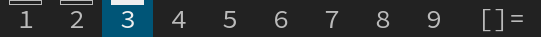
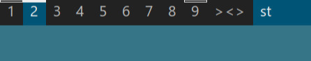
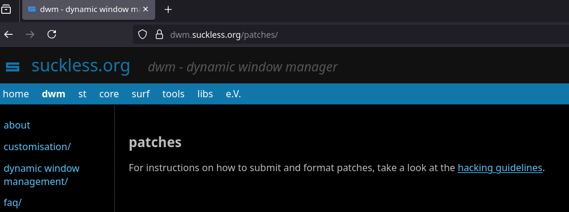
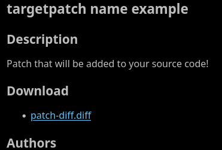
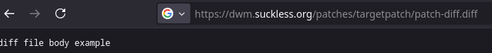
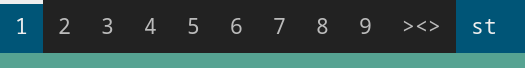
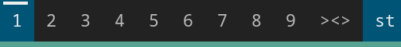
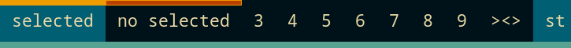
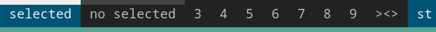
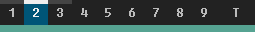

<h1 align='center'>


Full Tag Indicator Patch

</h1>

A **DWM patch** that mimics the [activetagindicatorbar patch].

[activetagindicatorbar patch]: https://dwm.suckless.org/patches/activetagindicatorbar/

> [!WARNING]
>
> This isn't the original README file and project _(it's just for
> issue/PR tracking and guidelines, instead...)_.
>
> You can also:
> - check the [original README]
> - check the [official dwm repo]
>
> All this page bellow is related to the latest patch release
> (`6.5.1` | 2025-07-16)!

[original README]: README.old.txt
[official dwm repo]: https://git.suckless.org/dwm

Table of contents
-----------------

1. [What and why]
2. [Install]
    - [Version]
        - Which major/minor version should I use?
        - How can I know my DWM version?
        - Which revision/patch version should I use?
        - About major/minor versions (before installing)
    - [Get the diff file]
        - Downloading from GitHub releases
        - Downloading from DWM patches page
    - [Patching]
    - [Compiling]
3. [Tips and customization]
    - [Bar height and thickness]
    - [Indicator position]
    - [Indicator width]
    - [Coloring]
    - [Border]
    - [Smart dimensions]
    - [My personal setup]
4. [Warnings]
5. [Contributors]

[What and why]: #what-and-why
[Tags Changelog]: #tags-changelog
[Install]: #install
[Version]: #version
[Get the diff file]: #get-the-diff-file
[Patching]: #patching
[Compiling]: #compiling
[Tips and customization]: #tips-and-customization
[Bar height and thickness]: #bar-height-and-thickness
[Indicator position]: #indicator-position
[Indicator width]: #indicator-width
[Coloring]: #coloring
[Border]: #border
[Smart dimensions]: #smart-dimensions
[My personal setup]: #my-personal-setup
[Warnings]: #warnings
[Contributors]: #contributors

What and why
------------

This project is based on the [activetagindicatorbar patch], which
looks like this:

<div align='center'>



</div>

[activetagindicatorbar patch]: https://dwm.suckless.org/patches/activetagindicatorbar/

It's a cool way to personalize the occupied monitor but it fails in
terms of customization:

- [ ] Customize bar height
- [ ] Customize bar color
- [ ] Customize bar border
- [ ] Customize bar padding _(from tag sides)_

So, I've decided to implement all of these features, turning vanilla
**DWM** into a more _'[riceable]'_ environment!

[riceable]: https://www.reddit.com/r/unixporn/comments/45l5if/what_is_the_etymology_of_the_word_rice/

Then, the default patch implementation will looks like this: _(take a
look to [customization])_

<div align='center'>



</div>

[customization]: #customization

Install
-------

Before diving deep into the install steps, we need to take a look at
dwm/patches versions and it's importance!

### Version

By reading the [suckless hacking page] _(which provides a ton of
contribution guides)_, we find the following mention:

[suckless hacking page]: https://suckless.org/hacking/

> For release versions:
>
> > toolname-patchname-RELEASE.diff
> > dwm-allyourbase-6.1.diff
>
> The RELEASE should correspond to the tool release version, ie 6.1
> for dwm-6.1.

Basically, there are a lot of versions for DWM software, but this
patch was built under the `6.5` version. Applying this patch to a
smaller version can cause **(compile/run)time errors**.

#### Which major/minor version should I use?

To avoid merge conflicts and unexpected bugs, you must always choose
like:

| Your DWM version            | Patch version |
| :-------------------------: | :-----------: |
| `6.5`                       | `6.5.x`       |
| `6.6` (for future versions) | `6.6.x`       |
| `...`                       | `...`         |

#### How can I know my DWM version?

Just run this command:

```sh
dwm -v
```

It will print something like `dwm-6.4`. So, the number following
`"dwm"` is your dwm version.

#### Which revision/patch version should I use?

If there's different patches for the same dwm version (like `6.5.1`,
`6.5.2`, `...`) it probably means a `bug-fix` or
`feature implementation`. You should read the page of the given
release.

#### About major/minor versions (before installing)

Some major/minor version can be missing (ie latest dwm version is
`6.6` but latest patch version is `6.5.x`). This means:

- `A)` The updated patch version has not been built/pushed yet
- `B)` There are no changes in the source code that justify an
       update in the patch implementation.

> [!TIP]
>
> I strongly recommend to always consider the `A` option before
> adding this patch.
>
> All update changelog will be disposed at the release page.

You can also create a backup of your current dwm setup before
patching.

You can do this with:

1. dir. copying:
```sh
cp path/to/your/DWM-SETUP ./DWM-SETUP.bak
```

2. tar:
```sh
tar -cvf dwm.bak.tar path/to/your/DWM-SETUP/
```

### Get the diff file

> [!NOTE]
>
> This step may require [`curl`][curl] program!

[curl]: https://curl.se/

You can get the diff file from:

1. github release _(must updated)_
2. official suckless patch page _(guaranteed stability)_

#### Downloading from GitHub releases

You can download it from the [release page itself] or by using the
curl program too:

[release page itself]: https://github.com/nasccped/dwm-fulltag-indicator/releases

```sh
# first, go to your dwm source path
cd your/dwm/source/path
# then, get the diff file
curl -L -O https://github.com/nasccped/dwm-fulltag-indicator/releases/download/dwm-fulltagindicator-6.5.1/dwm-fulltagindicator-6.5.1.diff
```

> [!WARNING]
>
> - The code above is just an example. It'll download the `6.5.1`
>   release. Make sure to get the correct version for your setup!
> - Downloading directly from your browser will probably drop the
>   diff file at `/home/username/Downloads`. Then, you'll need to
>   manually move it to your dwm source path.

#### Downloading from DWM patches page

| steps | description                                      | image                                                     |
| :---- | :----------------------------------------------- | :-------------------------------------------------------- |
| 1     | Go the the [dwm patches page]                    |            |
| 2     | Find the target patch and click on the diff link |  |
| 3     | Copy the url of the diff file                    |          |
| 4     | Then, open your terminal and                     | ...                                                       |

[dwm patches page]: https://dwm.suckless.org/patches/

- Go to your dwm source path:
```sh
cd dwm/source/path
```
- Download the diff file using curl:
```sh
# This won't work. It's just an example URL
curl -O https://dwm.suckless.org/patches/targetpatch/patch-diff.diff
```

### Patching

> [!NOTE]
>
> The `patch` program is required to proceed with this section!

Use the following command to merge the diffs:
```sh
patch --merge -i DIFF-FILE-NAME.diff
```

This will merge all difs from the diff file into the designed
destination. If your DWM setup is fresh, this probably won't result
in any conflict, else, you'll need to fix it manually!

> [!TIP]
>
> If you prefer, you can run the command without the `--merge` flag.
> It'll create `.rej` files when failed to merge.

### Compiling

1. All static features (default values - variables) are pushed to
   `config.def.h` file. So, before compiling, you must delete the
   `config.h` to apply all changes:
   ```sh
   rm config.h
   ```
2. Is recommended to remove all binary/object files too before
   generating the binaries:
   ```sh
   # You must run as super user
   sudo make clean install
   ```
3. Quit your X server, start it again with startx and it's done!

Tips and customization
----------------------

By default, this patch implementation comes like this:

<div align='center'>


</div>

### Bar height and thickness

The indicator draw has no way to know the statusbar/font height, and
**yes**! The indicator can override the tag name. To prevent this,
consider using the [`barheight patch`][barheight-patch] too, and you
can go from the image above to this:

[barheight-patch]: https://dwm.suckless.org/patches/bar_height/

<div align='center'>



</div>

To customize the indicator thickness, you need to change the
`fti_height` at `config.def.h` file!

### Indicator position

The indicator can be placed both at top or bottom of the tag. Just
change the `fti_top` variable.

### Indicator width

The indicator width will **always** fit to the entire tag. To control
the indicator width, you should use the padding values
(`fti_p<SIDE_NAME>`) instead. This ensures no tag overflow when
drawing the rectangle:

<div align='center'>



</div>

### Coloring

Instead of using DWM setup colors, I've prepared a different set of
colors for indicator. There's four different kinds of colors:

1. when the indicator is on the selected tag
2. when the indicator is on a non selected tag
3. same as the above but for inverse mode

<div align='center'>



</div>

> There's also the border color, but I'll talk about it in the
> section above.

By default, the indicator color follows the same as standard DWM
setup (**mid-blue** + **tones of gray**).

You can set specific color palettes or link DWM setup with indicator
color by using the C's `define`:

```c
#define WHITE_COLOR "#eeeeee"

/* set on dwm const */
static const char col_gray4[] = WHITE_COLOR;

/* set on patch const */
static const char fti_color_sel[] = WHITE_COLOR;

/* Do the same thing for all colors */
```

### Border

You can't customize the indicator border color/size. By default, the
border will have `1px` thickness + the same color as the indicator
when it's on the selected tag. Instead, you can specify if the border
is enabled by the `fti_border`:

<div align='center'>



</div>

Note that when turning off the border, the indicator rectangle will
still be draw. Make sure to use a different color hex from the tag
background, or the indicator can disappear...

### Smart dimensions

Before drawing the indicator rectangle, a lot of dimension tests
occurs:

- if indicator is on top, ignore bottom padding and vice-versa
- if indicator height + top|bottom padding is greater than the tag
  itself, don't draw it
- if sum of indicator side paddings (left and right) are equals or
  greater than the tag width, don't draw it

These constraints helps to avoid tag and window overriding. Make sure
to use padding values that are supported by the tag dimension!

### My personal setup

The image above is my personal patch implementation:

<div align='center'>



</div>

You can find all my dwm configs at my [personal dwm repository]!

[personal dwm repository]: https://github.com/nasccped/dwm.conf

Warnings
--------

If you've already applied a tag/statusbar change, adding this patch
will probably result into merging conflict.

Here are some patches that I think will result in conflict:
- [activetagindicatorbar](https://dwm.suckless.org/patches/activetagindicatorbar/)
- [barpadding](https://dwm.suckless.org/patches/barpadding/)

> [!TIP]
>
> If there's some merging conflict with your setup and this patch,
> consider opening an issue, then I can try to help!

Contributors
------------

> [!TIP]
>
> If you have contributed with this project in any way, consider
> opening an [issue] with the **"Be a contributor"** template!

[issue]: https://github.com/nasccped/dwm-fulltag-indicator/issues

- Owners:
    - [nasccped](https://github.com/nasccped)
- Contributors:
